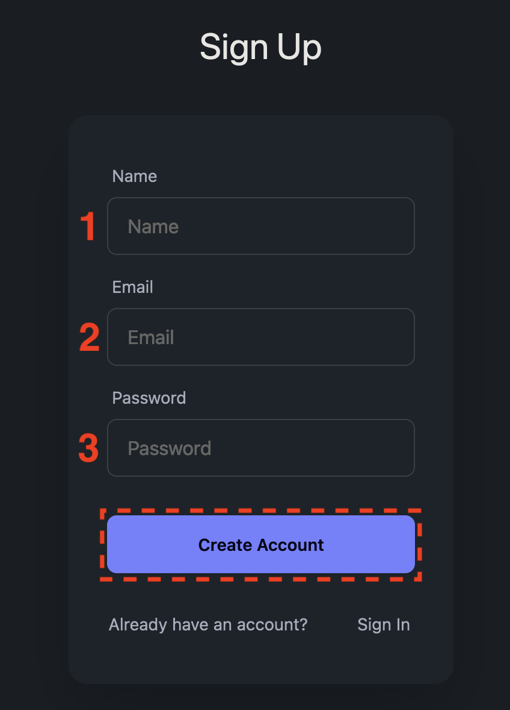

# Dev Diaries User Manual

## Outline

1. Introduction to Dev Diaries
    - About Dev Diaries
    - Goals and Objectives

2. Getting Started
    - Sign-In/Sign-Up Process
    - Dashboard Overview
    - Navigation & Interface Elements

3. Managing Projects
    - Creating a New Project
    - Project Overview & Tiles
    - Accessing a Project

4. Project Tiles & Functionalities
    a. GitHub Integration
        - Setting up GitHub for Live Updates
        - Viewing Recent Commits & Issues
    b. Milestones & Sprints
        - Creating Milestones/Sprints
        - Syncing with GitHub
    c. Research & Bookmarks
        - Organizing Research Notes
        - Sharing Resources with Teammates
    d. Communication
        - Accessing & Using Chat Functionality
        - Adding/Removing Team Members

5. GitHub Integration
    - Exploring GitHub Updates & Statistics
    - Viewing Commit Details

6. Navigation & User Flow
    - Moving Between Project Sections
    - Return to Landing Page

7. Preferences & Settings
    - Dark/Light Mode Toggle
    - Accessing User Settings
    - Logging Out

8. User Stories and Interactions
    - User Stories & Scenarios
    - Corresponding User Interactions

---

## 1. Introduction to Dev Diaries

### About Dev Diaries
Dev Diaries is a free web application designed to streamline project management for developers. Our aim is to provide a comprehensive platform for project planning and collaboration across various stakeholders, from project managers to developers and investors. With a user-friendly interface, Dev Diaries enhances the development experience for all users.

### Goals and Objectives
Our primary goal is to offer a central hub for project management, delivering a range of features that cater to the diverse needs of different team members. From real-time GitHub updates to efficient communication tools and time management features, Dev Diaries strives to simplify project handling and collaboration.

## 2. Getting Started

### Sign-In/Sign-Up Process

1. **Signing In:**
    - Enter your registered credentials (username and password) in the provided fields on the sign-in page.
    - Click the "Login" button to access your Dev Diaries dashboard.

    
  <figcaption>Figure 1: Sign In</figcaption>
</figure>

2. **Signing Up:**
    - If you don't have an account, click on “Sign Up"
    - Fill in the required details:
        1. Name: Must be a minimum of 3 characters.
        2. Email: Must be a valid email format and at least 6 characters.
        3. Password: Must be a minimum of 6 characters.
    - Click the "Create Account” button to create your Dev Diaries account.

  
  <figcaption>Figure : </figcaption>
</figure>

### Dashboard Overview

The dashboard presents a clean interface displaying user projects. Users' names and IDs are prominently displayed in the header for easy identification (1). It includes an "Add Project" button for creating new projects (2), and a search bar for quick project access (3).

### Navigation & Interface Elements

- **Header:** Displays the "Dev Diaries" title and features a toggle for dark/light modes (4). It also includes a side navigation bar (5). Clicking on the navigation bar icon (5) opens the side navigation with options for Home (1), Settings (2), and Logout (3).

## 3. Managing Projects

### Creating a New Project

Users can create new projects by clicking the "Add Project" button (3) on the dashboard. The CreateProject popup appears and requires a unique project name (4). Clicking the “Create Project” button (5) to complete this process.

### Project Overview & Tiles

When a project is selected, users are directed to a project-specific page displaying tiles representing different aspects of project management. These tiles offer specific functionalities related to GitHub integration, milestones/sprints, research/bookmarks, and communication.

### Accessing a Project

By clicking into a project tile, users access specific functionalities related to that aspect of project management, such as GitHub integration, milestone/sprint setup, research organization, or communication tools.

## 4. Project Tiles & Functionalities

### a. GitHub Integration

#### Setting up GitHub for Live Updates

1. Click on the "Setup GitHub" tile.
2. Enter the required details: Repository URL, Owner, Repo Name.
3. Click "Add Repo" to link your project to the GitHub repository for automatic updates.

#### Viewing Recent Commits & Issues

1. Navigate to the "GitHub" tile.
2. Choose "See Commits" or "See Issues" to access detailed information on recent code commits and reported issues.

### b. Milestones & Sprints

#### Creating Milestones/Sprints

1. Select "Setup/See" under Milestones/Sprints.
2. Choose "Manual Create" to create a new sprint or milestone.
3. Enter details such as Name, Start Date, and Deadline.
4. Click "Add Sprint" to create the milestone/sprint.

#### Syncing with GitHub

1. While creating a milestone/sprint, select "Sync with GitHub" to align it with your GitHub repository.

### c. Research & Bookmarks

#### Organizing Research Notes

1. Access the "Research Notes" tile.
2. Click "Add Note" to create a new note.
3. Input Title, Details, URL (if applicable), and assign it to a specific sprint or milestone.
4. Click "Create Note" to save and organize the note.

#### Sharing Resources with Teammates

1. Create a note as explained above.
2. The note will be accessible to team members within the specified sprint or milestone.

### d. Communication

#### Accessing & Using Chat Functionality

1. Click on "See Chat" to access the chat feature.
2. Use the search option or scroll to find past messages.
3. Type in the message field and press "Send" to communicate with team members.

#### Adding/Removing Team Members

1. Click "Add/See User" to manage team members.
2. To add a member, enter their username or email and click "Add Member."
3. To remove a member, select the user and click "Remove."

## 5. GitHub Integration

### Exploring GitHub Updates & Statistics

#### Viewing Commit Details

1. Select "See Commits" to view the latest commits.
2. Sort commits by choosing options such as "Newest" or "Oldest."
3. Filter commits by user or search term.

## 6. Navigation & User Flow

### Moving Between Project Sections

To navigate between project sections, simply click on the desired tile representing the feature or functionality you wish to access.

## 7. Preferences & Settings

### Dark/Light Mode Toggle

Toggle between Dark and Light modes by clicking on the moon/sun icon in the header.

### Accessing User Settings

Access and modify user settings by clicking on the "Settings" option in the side nav bar.

### Logging Out

To log out of your Dev Diaries account, click on "Logout" in the side nav bar.

## 8. User Stories and Interactions

### User Stories & Scenarios

Each user story corresponds to specific actions within Dev Diaries. Refer to the following steps to accomplish tasks aligned with user stories:
- Developer Requiring External Help:
    - Use the "Research Notes" feature to save helpful websites or resources.
    - Organize resources by creating notes and categorizing them under relevant sprints or milestones.
    - Share resources with team members by assigning notes to specific project phases.
- Project Manager Tracking Team Progress:
    - Access live updates from the GitHub repository via the corresponding tile.
    - Monitor recent commits and issues to track team activity.
    - Use the chat functionality to communicate with team members and stay updated on project discussions.

### Corresponding User Interactions

Interact with Dev Diaries using the guided steps provided to accomplish specific tasks associated with user stories and scenarios.
