# Dev Diaries User Manual

## Outline

1. Introduction to Dev Diaries
    - About Dev Diaries
    - Goals and Objectives

2. Getting Started
    - Sign-In/Sign-Up Process
    - Dashboard Overview
    - Navigation & Interface Elements

3. Managing Projects
    - Creating a New Project
    - Project Overview & Tiles
    - Accessing a Project

4. Project Tiles & Functionalities
    - GitHub Integration
        - Setting up GitHub for Live Updates
        - Viewing Recent Commits & Issues
    - Milestones & Sprints
        - Creating Milestones/Sprints
        - Syncing with GitHub
    - Research & Bookmarks
        - Organizing Research Notes
        - Sharing Resources with Teammates
    - Communication
        - Accessing & Using Chat Functionality
        - Adding/Removing Team Members

5. Navigation & User Flow
    - Moving Between Project Sections
    - Return to Landing Page

6. Preferences & Settings
    - Dark/Light Mode Toggle
    - Accessing User Settings
    - Logging Out

7. User Stories and Interactions
    - User Stories & Scenarios
    - Corresponding User Interactions

---

## 1. Introduction to Dev Diaries

### About Dev Diaries
Dev Diaries is a free web application designed to streamline project management for developers. Our aim is to provide a comprehensive platform for project planning and collaboration across various stakeholders, from project managers to developers and investors. With a user-friendly interface, Dev Diaries enhances the development experience for all users.

### Goals and Objectives
Our primary goal is to offer a central hub for project management, delivering a range of features that cater to the diverse needs of different team members. From real-time GitHub updates to efficient communication tools and time management features, Dev Diaries strives to simplify project handling and collaboration.

## 2. Getting Started

### Sign-In/Sign-Up Process

1. **Signing In:** ([Figure 1](#f1))
    - Enter your registered credentials: email ([1-1](#f1)) and password ([1-2](#f1)) in the provided fields on the sign-in page.
    - Click the "Login" button ([1-3](#f1)) to access your Dev Diaries dashboard.  

    
<figure>
    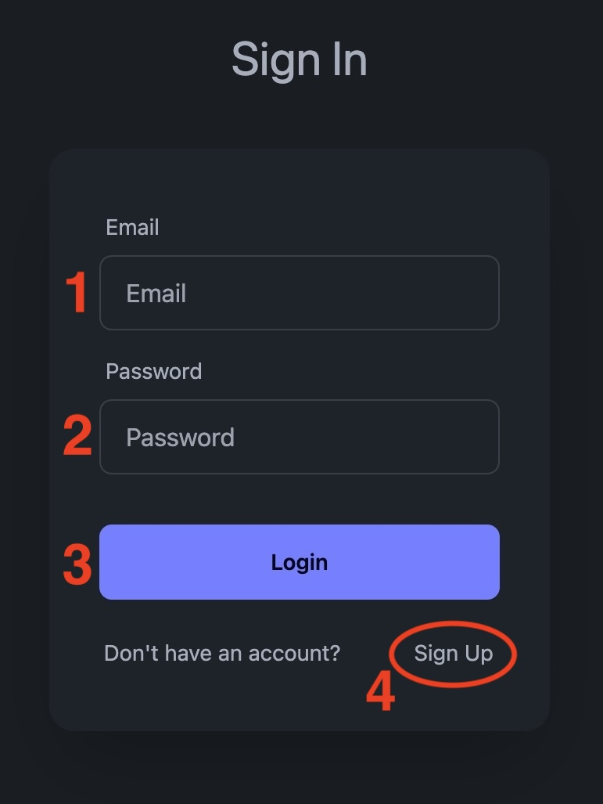
  <figcaption>Figure 1: Sign In</figcaption>
</figure>   

 

2. **Signing Up:** ([Figure 1](#f1)), ([Figure 2](#f2))
    - If you don't have an account, click on “Sign Up" ([1-4](#f1)).
    - Fill in the required details:
        1. Name: Must be a minimum of 3 characters ([2-1](#f2)).
        2. Email: Must be a valid email format and at least 6 characters ([2-2](#f2)).
        3. Password: Must be a minimum of 6 characters ([2-3](#f2)).
    - Click the "Create Account” ([2-4](#f2)) button to create your Dev Diaries account.
    - To return to the Sign In page, click Sign Up ([2-5](#f2)).

<figure>
  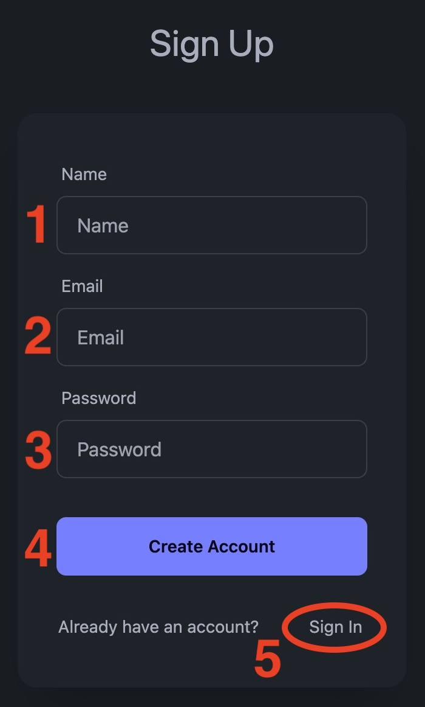
  <figcaption>Figure 2: Sign Up</figcaption>
</figure>

### Dashboard Overview

1. **Add Project** ([Figure 3](#f3)) 
   - The user dashboard displays an "Add Project" button ([3-1](#f3))  for creating new projects, a search bar for quick project access ([3-2](#f3)), and each project listed ([3-3](#f3)).

<figure>
  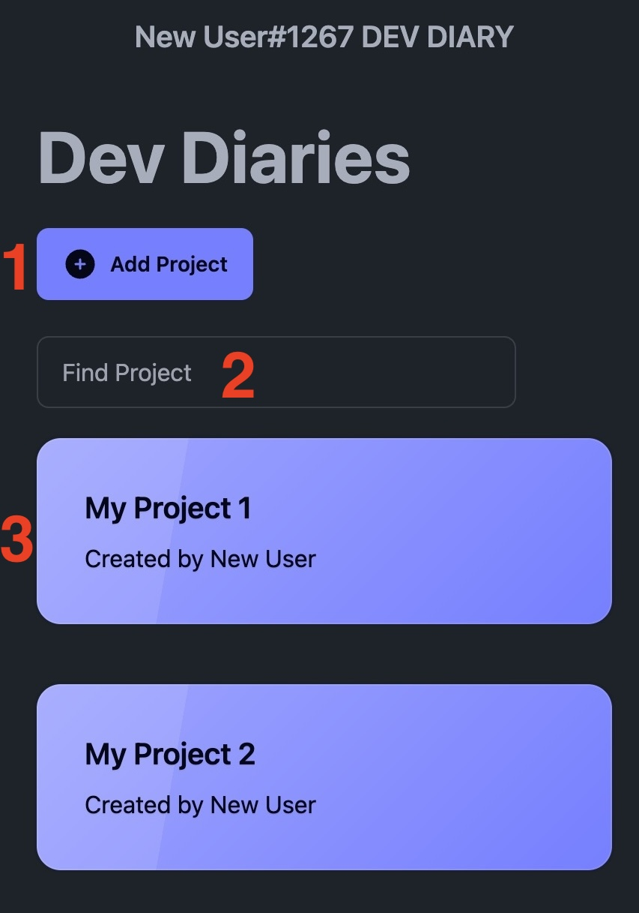
  <figcaption>Figure 3: Dashboard Overview</figcaption>
</figure>

### Navigation & Interface Elements

<figure>
  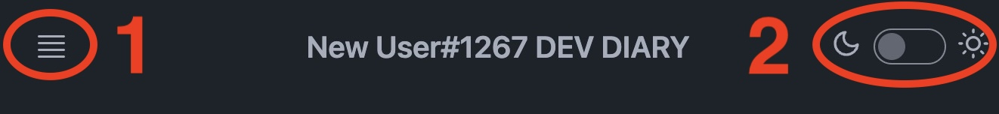
  <figcaption>Figure 4: Header & Interface Elements</figcaption>
</figure>

1. **Header:** ([Figure 4](#f4)) ([Figure 5](#f4))
    - The header, found on each page, displays the "Dev Diary" title; clicking on it will return you to your dashboard. It includes a side navigation bar ([4-1](#f4)).  It also features a toggle for dark/light modes ([4-2](#f4)). Clicking on the navigation bar icon ([4-1](#f4)) opens the side navigation with options for Home ([5-1](#f5)), Settings ([5-2](#f5)), and Logout ([5-3](#f5)).

<figure>
  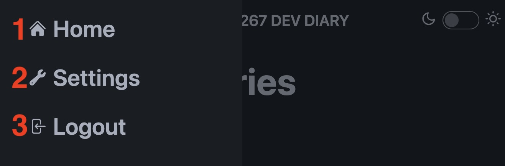
  <figcaption>Figure 5: Navigation</figcaption>
</figure>

## 3. Managing Projects

### Creating a New Project
([Figure 3](#f3)) ([Figure 7](#f7)) 
Users can create new projects by clicking the "Add Project" button ([3-1](#f3)) on the dashboard. The Create Project popup appears and requires a unique project name ([7-1](#f7)). Clicking the “Create Project” button ([7-2](#f7)) to complete this process. 

<figure>
  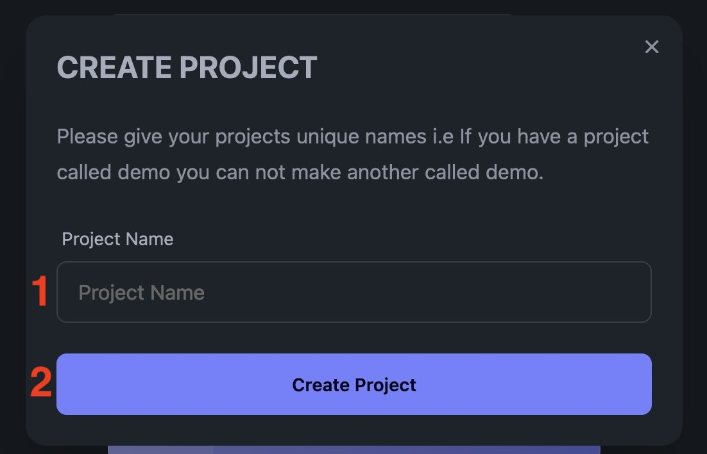
  <figcaption>Figure 7: Create a New Project</figcaption>
</figure>

### Project Overview & Tiles

([Figure 8](#f8))  
When a project is selected, users are directed to a project-specific page displaying tiles representing different aspects of project management. These tiles offer specific functionalities related to GitHub integration ([8-2](#f8)), milestones/sprints ([8-3](#f8)), research/bookmarks ([10-4](#f10)), and communication ([8-4](#f8)). To delete a project, click the delete button ([8-2](#f8)).

<figure>
  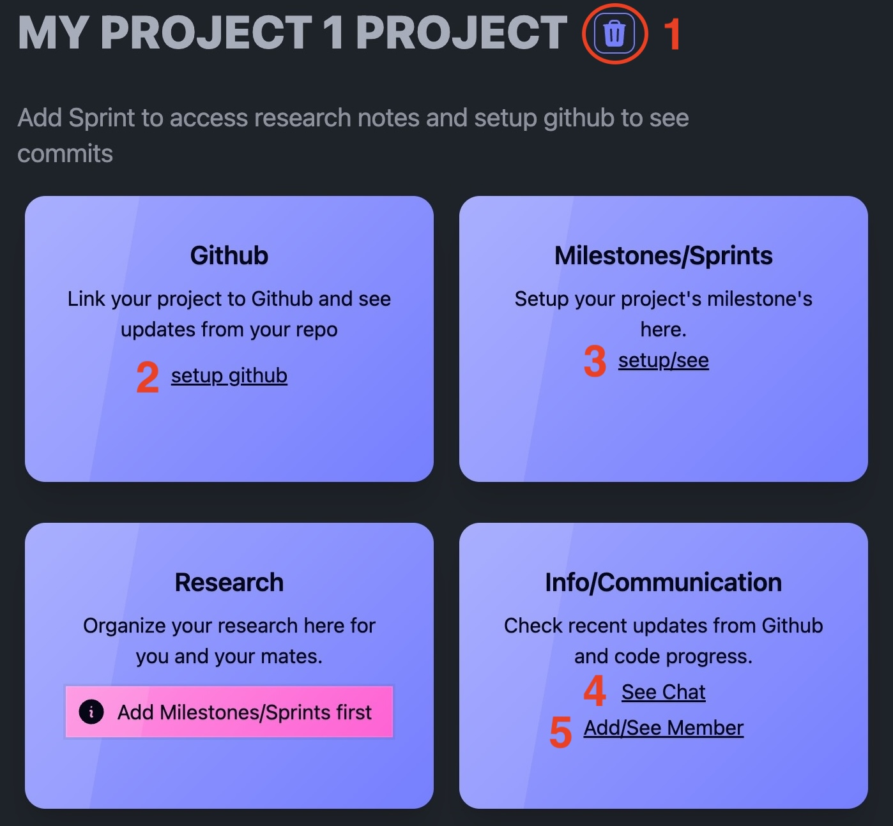
  <figcaption>Figure 8: Project Overview</figcaption>
</figure>

## 4. Project Tiles & Functionalities

### a. GitHub Integration

#### Setting up GitHub for Live Updates

([Figure 8](#f8)) ([Figure 9](#f9))
1. Click "Setup GitHub" ([8-3](#f8))
2. Enter the required details: Repository owner ([9-1](#f9)) and repository name ([9-2](#f9)) 
3. Click "Add Repo" ([9-3](#f9)) to link your project to the GitHub repository for automatic updates.

<figure>
  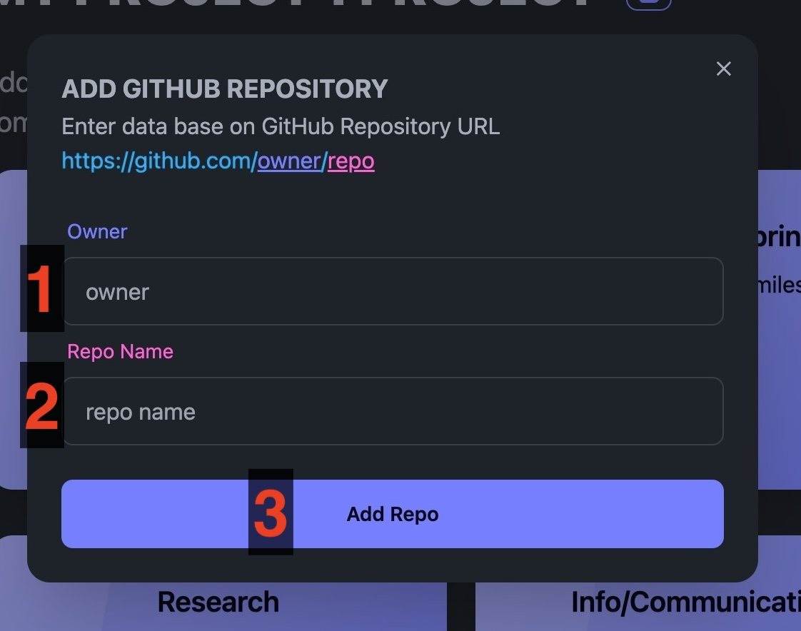
  <figcaption>Figure 9: Setup Repository</figcaption>
</figure>

#### Viewing Recent Commits & Issues

([Figure 10](#f10))
1. You will now be able to access commits ([10-1](#f10)) and issues ([10-2](#f10))
2. Click update ([10-3](#f10)) to update the owner or repo name.

<figure>
  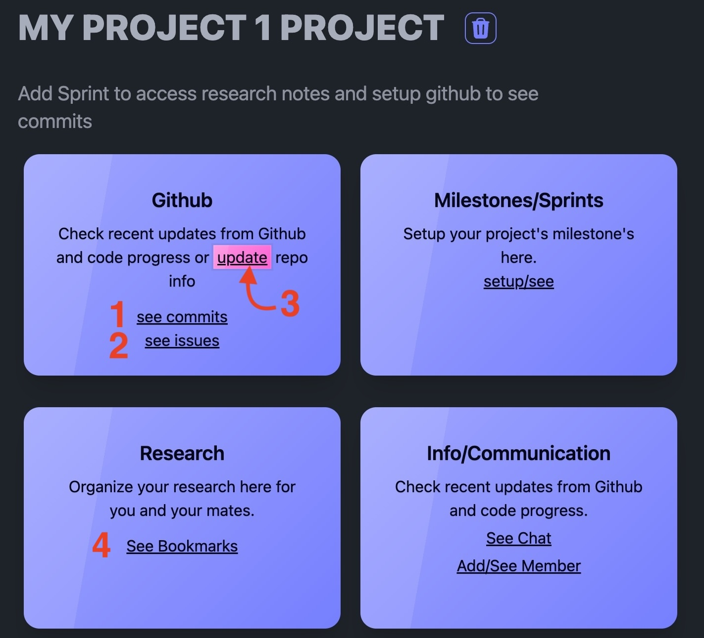
  <figcaption>Figure 10: Connected Project</figcaption>
</figure>

### Commits
([Figure 10](#f10)) ([Figure 11](#f11))
1. Clicking on see commits ([10-1](#f10)) will bring you to your commits summary for the last 100 commits ([11](#f11))
2. Click on your project name ([11-1](#f11)) to open your GitHub repository in a new tab
3. To sort your last 100 commits, click the dropdown box ([11-2](#f11)) to select sort order - either by newest or oldest, and click Sort ([11-3](#f11))
4. Select a user ([11-4](#f11)) to filter commits by author
5. Type a search term to filter by commit message ([11-5](#f11))
6. Click filter ([11-6](#f11)) to apply your search parameters
7. The last 100 commits will appear below ([11-7](#f11)) if no search parameters set, otherwise the commits matching your search parameters will be listed

<figure>
  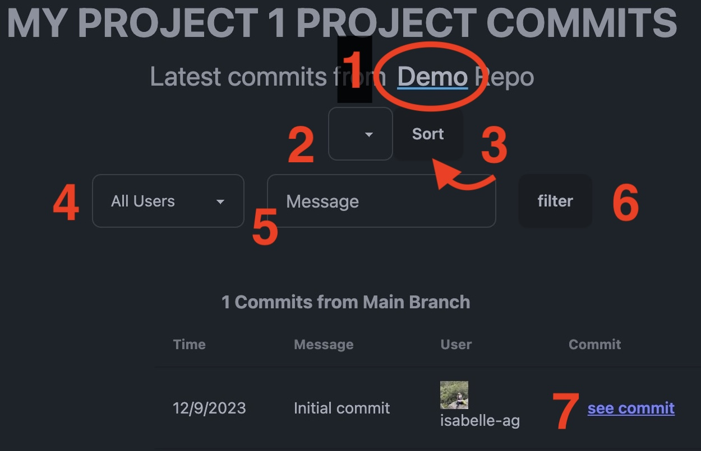
  <figcaption>Figure 11: Commits</figcaption>
</figure>

### Issues
([Figure 10](#f10)) ([Figure 12](#f12))
1. To access your projects issues, click see issues ([10-3](#f10)); to return to your project overview, click Back to Project page ([12-1](#f12))
2. Filter issues by Open ([12-2](#f12)) or Recently Closed ([12-3](#f12))
3. Enter a label ([12-4](#f12)) or milestone ([12-5](#f12)) search term to filter further

<figure>
  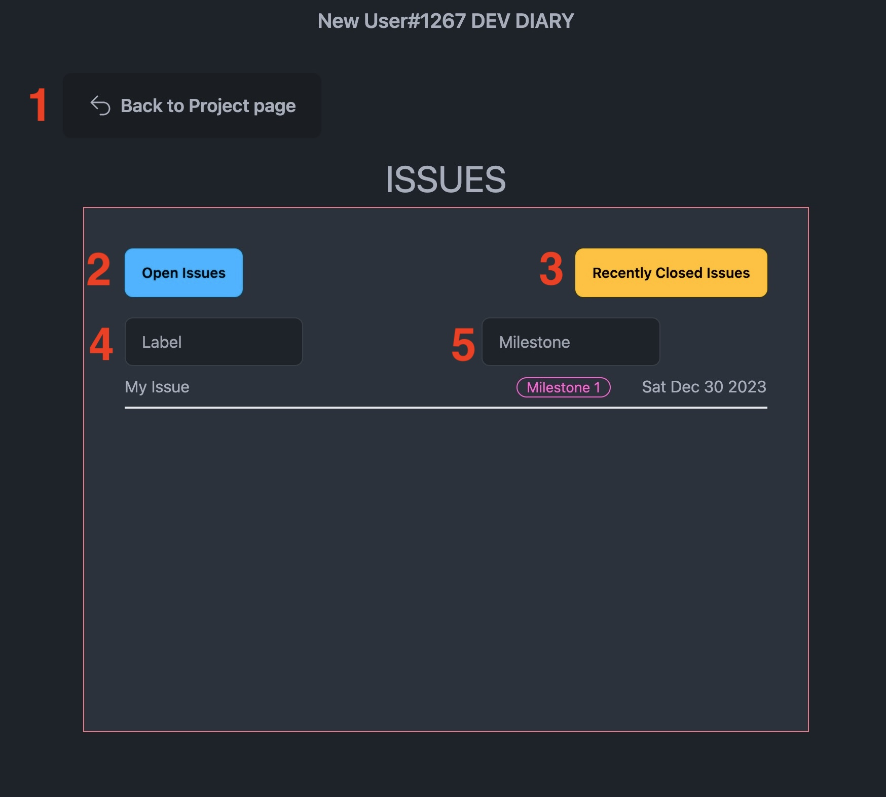
  <figcaption>Figure 12: Issues</figcaption>
</figure>

### b. Milestones & Sprints

<figure>
  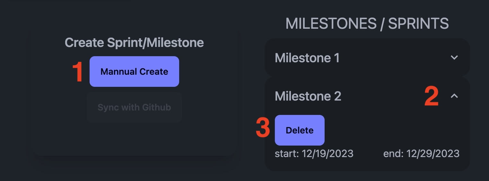
  <figcaption>Figure 13: Milestones</figcaption>
</figure>

#### Creating Milestones/Sprints
([Figure 8](#f8)) ([Figure 13](#f13)) ([Figure 14](#f14)) ([Figure 15](#f15))
1. Select "Setup/See" under Milestones/Sprints ([8-4](#f8))
2. Choose "Manual Create" ([13-1](#f13)) to create a new sprint or milestone 
3. Enter sprint details: 
    - Name ([14-1](#f14))
    - Start Date ([14-2](#f14)) 
    - Deadline ([14-3](#f14))
4. A calendar will pop up when you click on the start or deadline fields to select the date ([15](#f15)) 
5. Click "Add Sprint" ([14-4](#f14)) to create the milestone/sprint.
6. Or click the x in the top right ([14-5](#f14)) or hit escape on your keyboard to cancel 

<figure>
  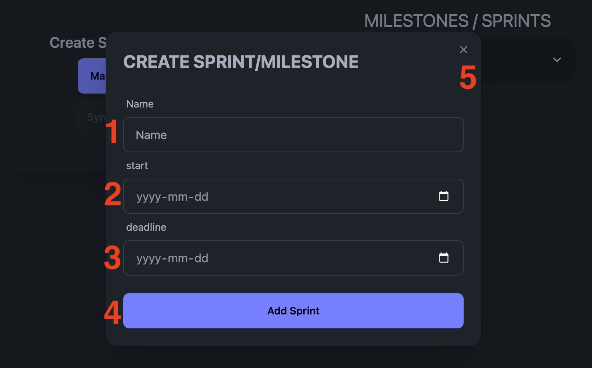
  <figcaption>Figure 14: Create a Milestone</figcaption>
</figure>

<figure>
  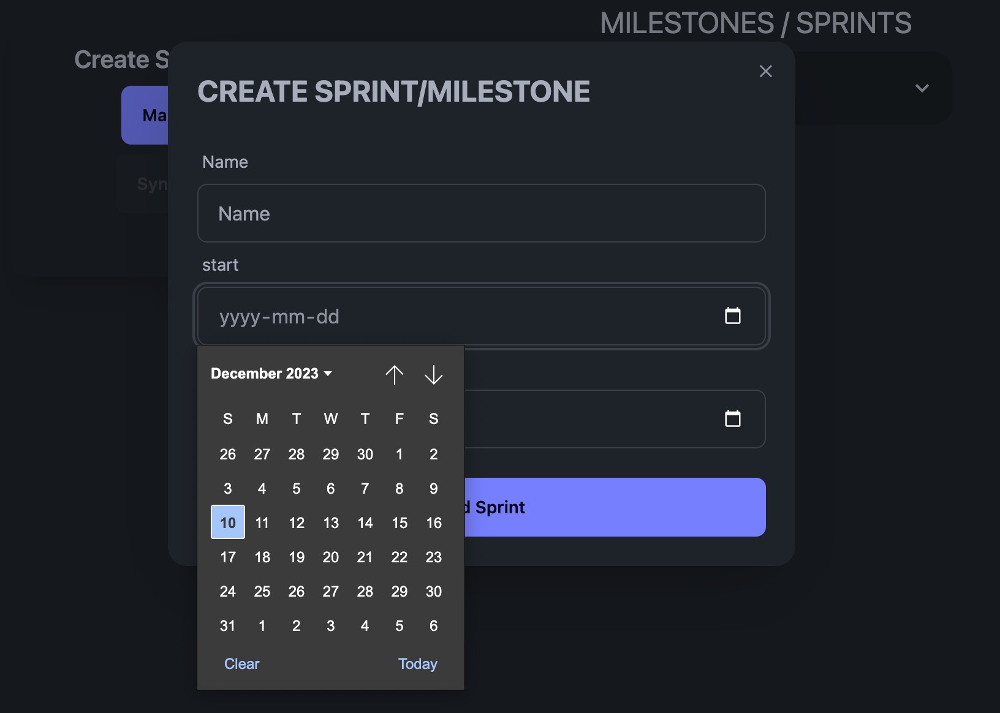
  <figcaption>Figure 15: Date Selection</figcaption>
</figure>

#### See Milestones/Sprints
([Figure 13](#f13))
1. Click the arrow next to a milestone's name to expand ([13-2](#f13)) and see the start and end dates of the milestone
2. To delete the milestone, click the Delete button ([13-3](#f13))

### c. Research & Bookmarks

<figure>
  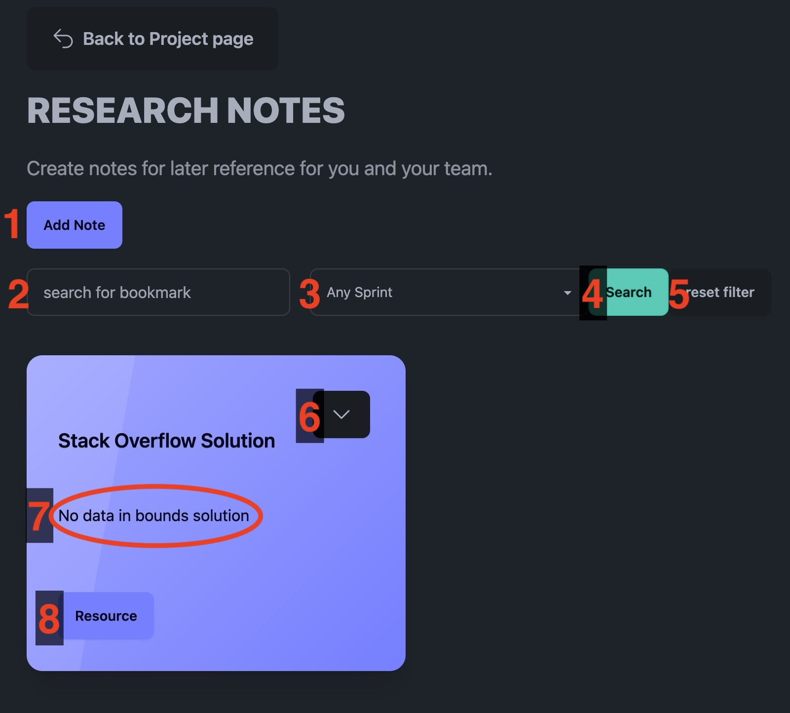
  <figcaption>Figure 16: Research Notes</figcaption>
</figure>

#### Creating Research Notes
([Figure 10](#f10)) ([Figure 16](#f16)) ([Figure 17](#f17))
1. Click the "See Bookmarks" section ([10-4](#f10))
2. Click "Add Note" ([16-1](#f16)) to create a new note 
3. Assign your note to a specific sprint or milestone ([17-1](#f17))
4. Input Title ([17-2](#f17)), Details ([17-3](#f17)), and URL ([17-4](#f17))
4. Click "Create Note" ([17-5](#f17)) to save research for reference

<figure>
  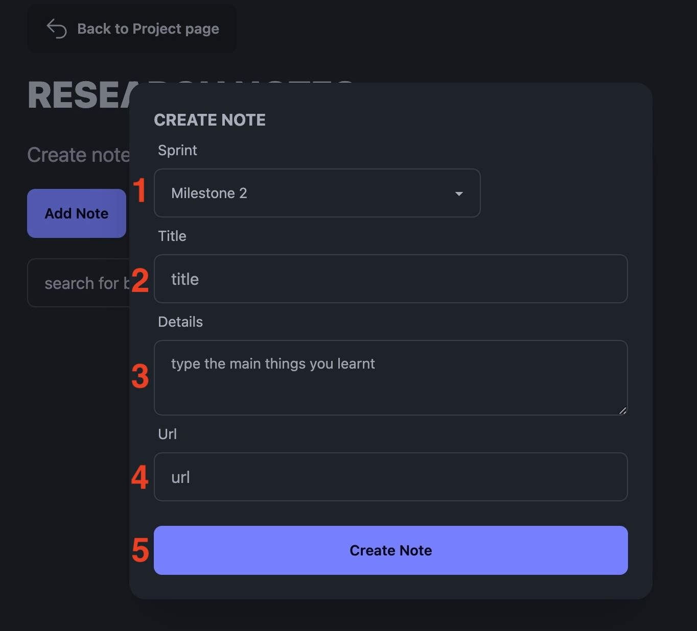
  <figcaption>Figure 17: New Research</figcaption>
</figure>

#### Sharing Resources with Teammates

1. Create a note as explained above.
2. The note will be accessible to team members within the specified sprint or milestone.

#### Review Research
([Figure 16](#f16))
1. Filter research by text ([16-2](#f16)) or sprint ([16-3](#f16))
2. Click Search ([16-4](#f16)) to view results
3. Click Reset ([16-5](#f16)) to reset filters
4. Click the arrow next to a note's title ([16-6](#f16)) to view the note ([16-7](#f16))
5. To open the link in a new tab, click Resource ([16-8](#f16))

### d. Communication

#### Accessing & Using Chat Functionality
([Figure 8](#f8)) ([Figure 18](#f18))
1. Click on "See Chat" ([8-5](#f8)) to access the chat feature
2. Use the search option ([18-2](#f18)) or scroll to find past messages 
3. To see the end or beginning of the chat, click Latest Messages ([18-3](#f18)) or Oldest Messages ([18-4](#f18)) respectively
4. See past messages from anyone within the project ([18-5](#f18))
4. Type in the message field ([18-6](#f18)) and press "Send" ([18-7](#f18)) to communicate with team members

<figure>
  
  <figcaption>Figure 18: New Research</figcaption>
</figure>

#### Adding/Removing Team Members
([Figure 8](#f8)) ([Figure 19](#f19))
1. Click "Add/See User" ([8-6](#f8)) to manage team members 
2. To add a member, select them from the dropdown box ([19-2](#f19)), then click Add Member ([19-3](#f19))
3. To remove a member, select the user and click "Remove" ([19-4](#f19))
4. The owner of the project will be listed here ([19-5](#f19))

<figure>
  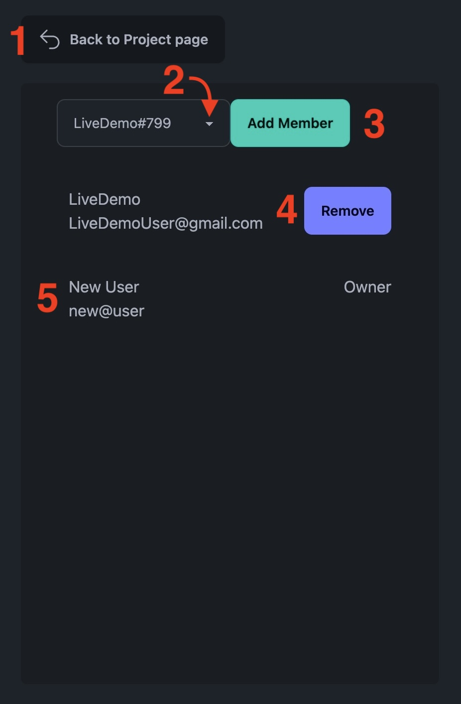
  <figcaption>Figure 19: Add Member</figcaption>
</figure>

## 5. Navigation & User Flow

### Moving Between Project Sections
([Figure 20](#f20))
1. To navigate between project sections, simply click on the desired tile representing the feature or functionality you wish to access
2. To return to the project overview, click the Back to Project Page button at the top of the page 

<figure>
  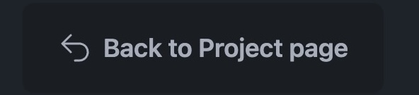
  <figcaption>Figure 20: Back to Project Page</figcaption>
</figure>

## 6. Preferences & Settings

### Dark/Light Mode Toggle
([Figure 21](#f21))
Toggle between Dark and Light modes by clicking on the moon/sun icon in the header 

<figure>
  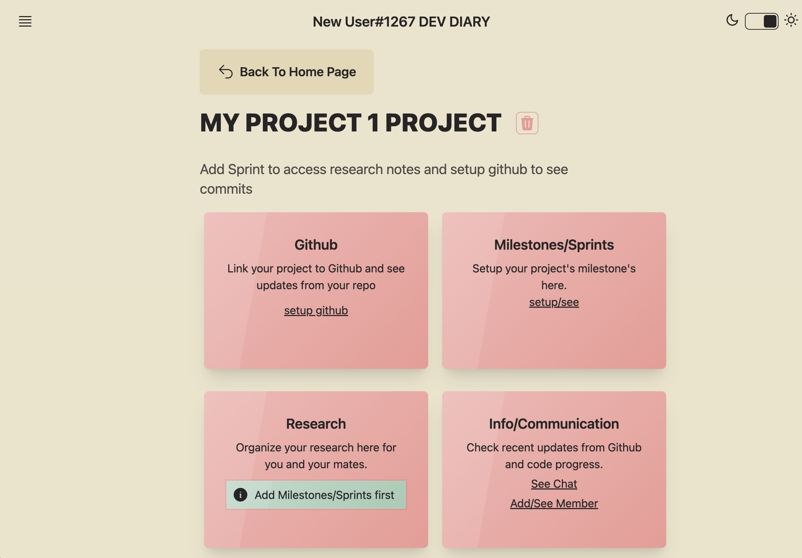
  <figcaption>Figure 21: Light Mode</figcaption>
</figure>

### Accessing User Settings
([Figure 6](#f6))
Access and modify user settings by clicking on the "Settings" option in the side nav bar ([6-2](#f6))

### Logging Out
([Figure 6](#f6))
To log out of your Dev Diaries account, click on "Logout" in the side nav bar ([6-3](#f6))

## 7. User Stories and Interactions

### User Stories & Scenarios

Each user story corresponds to specific actions within Dev Diaries. Refer to the following steps to accomplish tasks aligned with user stories:
- Developer Requiring External Help:
    - Use the "Research Notes" feature to save helpful websites or resources.
    - Organize resources by creating notes and categorizing them under relevant sprints or milestones.
    - Share resources with team members by assigning notes to specific project phases.
- Project Manager Tracking Team Progress:
    - Access live updates from the GitHub repository via the corresponding tile.
    - Monitor recent commits and issues to track team activity.
    - Use the chat functionality to communicate with team members and stay updated on project discussions.

### Corresponding User Interactions

Interact with Dev Diaries using the guided steps provided to accomplish specific tasks associated with user stories and scenarios.
