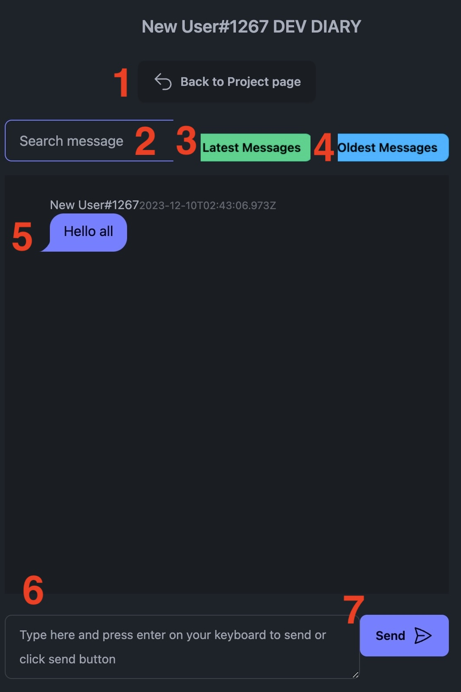

# Dev Diaries User Manual

## Outline

1. Introduction to Dev Diaries
    - About Dev Diaries
    - Goals and Objectives

2. Getting Started
    - Sign-In/Sign-Up Process
    - Dashboard Overview
    - Navigation & Interface Elements

3. Managing Projects
    - Creating a New Project
    - Project Overview & Tiles
    - Accessing a Project

4. Project Tiles & Functionalities
    - GitHub Integration
        - Setting up GitHub for Live Updates
        - Viewing Recent Commits & Issues
    - Milestones & Sprints
        - Creating Milestones/Sprints
        - Syncing with GitHub
    - Research & Bookmarks
        - Organizing Research Notes
        - Sharing Resources with Teammates
    - Communication
        - Accessing & Using Chat Functionality
        - Adding/Removing Team Members

5. Navigation & User Flow
    - Moving Between Project Sections
    - Return to Landing Page

6. Preferences & Settings
    - Dark/Light Mode Toggle
    - Accessing User Settings
    - Logging Out

7. User Stories and Interactions
    - User Stories & Scenarios
    - Corresponding User Interactions

---

## 1. Introduction to Dev Diaries

### About Dev Diaries
Dev Diaries is a free web application designed to streamline project management for developers. Our aim is to provide a comprehensive platform for project planning and collaboration across various stakeholders, from project managers to developers and investors. With a user-friendly interface, Dev Diaries enhances the development experience for all users.

### Goals and Objectives
Our primary goal is to offer a central hub for project management, delivering a range of features that cater to the diverse needs of different team members. From real-time GitHub updates to efficient communication tools and time management features, Dev Diaries strives to simplify project handling and collaboration.

## 2. Getting Started

### Sign-In/Sign-Up Process

1. **Signing In:**
    - Enter your registered credentials: email (1) and password (2) in the provided fields on the sign-in page ([Figure 1](#f1))
    - Click the "Login" button (3) to access your Dev Diaries dashboard.  
    
<figure>
    
  <figcaption>Figure 1: Sign In</figcaption>
</figure>   

 

2. **Signing Up:**
    - If you don't have an account, click on “Sign Up" (4) ([Figure 1](#f1))
    - Fill in the required details ([Figure 2](#f2))
        1. Name: Must be a minimum of 3 characters.
        2. Email: Must be a valid email format and at least 6 characters.
        3. Password: Must be a minimum of 6 characters.
    - Click the "Create Account” (4) button to create your Dev Diaries account.
    - To return to the Sign In page, click Sign Up (5)

<figure>
  
  <figcaption>Figure 2: Sign Up</figcaption>
</figure>

### Dashboard Overview

<figure>
  
  <figcaption>Figure 3: Dashboard Overview</figcaption>
</figure>

The user dashboard displays an "Add Project" button (1) for creating new projects, a search bar for quick project access (2), and each project listed (3) ([Figure 3](#f3)) 

### Navigation & Interface Elements

<figure>
  
  <figcaption>Figure 4: Header & Interface Elements</figcaption>
</figure>

- **Header:** 
The header, found on each page, displays the "Dev Diary" title; clicking on it will return you to your dashboard. It features a toggle for dark/light modes (2) ([Figure 5](#f5)). It also includes a side navigation bar (1). Clicking on the navigation bar icon (1) opens the side navigation with options for Home (1), Settings (2), and Logout (3) ([Figure 6](#f6)).

<figure>
  
  <figcaption>Figure 5: Light Mode</figcaption>
</figure>

<figure>
  
  <figcaption>Figure 6: Navigation</figcaption>
</figure>

## 3. Managing Projects

### Creating a New Project

Users can create new projects by clicking the "Add Project" button on the dashboard ([Figure 3](#f3)). The Create Project popup appears and requires a unique project name (1). Clicking the “Create Project” button (2) to complete this process. ([Figure 7](#f7))

<figure>
  
  <figcaption>Figure 7: Create a New Project</figcaption>
</figure>

### Project Overview & Tiles

When a project is selected, users are directed to a project-specific page displaying tiles representing different aspects of project management. These tiles offer specific functionalities related to GitHub integration, milestones/sprints, research/bookmarks, and communication. To return to your dashboard, click Back to Home Page (1). To delete a project, click the delete button (2) ([Figure 8](#f8)).

<figure>
  
  <figcaption>Figure 8: Project Overview</figcaption>
</figure>

## 4. Project Tiles & Functionalities

### a. GitHub Integration

#### Setting up GitHub for Live Updates

1. Click "Setup GitHub" (3) ([Figure 8](#f8))
2. Enter the required details: Repository owner (1) and repository name (2) ([Figure 9](#f9))
3. Click "Add Repo" (3) to link your project to the GitHub repository for automatic updates.

<figure>
  
  <figcaption>Figure 9: Setup Repository</figcaption>
</figure>

#### Viewing Recent Commits & Issues

1. You will now be able to access issues (1) and commits (2) ([Figure 10](#f10))
2. Click update (3) to update the owner or repo name.

<figure>
  
  <figcaption>Figure 10: Connected Project</figcaption>
</figure>

### Commits

1. Clicking on see commits (1) ([Figure 10](#f10)) will bring you to your commits summary for the last 100 commits ([Figure 11](#f11))
2. Click on your project name (1) to open your GitHub repository in a new tab
3. To sort your last 100 commits, click the dropdown box (2) to select sort order - either by newest or oldest, and click Sort (3)
4. Select a user (4) to filter commits by author
5. Type a search term to filter by commit message (5)
6. Click filter (6) to apply your search parameters
7. The last 100 commits will appear below (7) if no search parameters set, otherwise the commits matching your search parameters will be listed

<figure>
  
  <figcaption>Figure 11: Commits</figcaption>
</figure>

### Issues

1. To access your projects issues, click see issues (3) ([Figure 10](#f10)); to return to your project overview, click Back to Project page (1) ([Figure 12](#f12))
2. Filter issues by Open (2) or Recently Closed (3)
3. Enter a label (4) or milestone (5) search term to filter further

<figure>
  
  <figcaption>Figure 12: Issues</figcaption>
</figure>

### b. Milestones & Sprints

#### Creating Milestones/Sprints

1. Select "Setup/See" under Milestones/Sprints (4) ([Figure 8](#f8))
2. Choose "Manual Create" (2) to create a new sprint or milestone ([Figure 13](#f13))
3. Enter sprint details: ([Figure 14](#f14))
    - Name(1) 
    - Start Date (2) and 
    - Deadline (3)
4. A calendar will pop up when you click on the start or deadline fields to select the date ([Figure 14](#f14)) 
5. Click "Add Sprint" (4) to create the milestone/sprint.
6. Or click the x in the top right (5) or hit escape on your keyboard to cancel 

<figure>
  
  <figcaption>Figure 13: Milestones</figcaption>
</figure>

<figure>
  
  <figcaption>Figure 14: Create a Milestone</figcaption>
</figure>

<figure>
  
  <figcaption>Figure 15: Date Selection</figcaption>
</figure>

### c. Research & Bookmarks

#### Organizing Research Notes

1. Click the "See Bookmarks" section (4) ([Figure 10](#f10))
2. Click "Add Note" (1) to create a new note ([Figure 16](#f16))
3. Assign your note to a specific sprint or milestone (1) ([Figure 17](#f17))
4. Input Title (2), Details (3), and URL (4)
4. Click "Create Note" (5) to save research for reference

<figure>
  
  <figcaption>Figure 16: Research Notes</figcaption>
</figure>

<figure>
  
  <figcaption>Figure 17: New Research</figcaption>
</figure>

#### Sharing Resources with Teammates

1. Create a note as explained above.
2. The note will be accessible to team members within the specified sprint or milestone.

### d. Communication

#### Accessing & Using Chat Functionality

1. Click on "See Chat" (5) to access the chat feature ([Figure 8](#f8))
2. Use the search option (2) or scroll to find past messages ([Figure 18](#f18))
3. To see the end or beginning of the chat, click Latest Messages (3) or Oldest Messages (4) respectively
4. See past messages from anyone within the project (5)
4. Type in the message field (6) and press "Send" (7) to communicate with team members

<figure>
  
  <figcaption>Figure 18: New Research</figcaption>
</figure>

#### Adding/Removing Team Members

1. Click "Add/See User" (6) to manage team members ([Figure 8](#f8))
2. To add a member, select them from the dropdown box (2), then click Add Member (3) ([Figure 19](#f19))
3. To remove a member, select the user and click "Remove" (4)
4. The owner of the project will be listed here (5)

<figure>
  
  <figcaption>Figure 19: Add Member</figcaption>
</figure>

## 5. Navigation & User Flow

### Moving Between Project Sections

1. To navigate between project sections, simply click on the desired tile representing the feature or functionality you wish to access
2. To return to the project overview, click the Back to Project Page button at the top of the page ([Figure 20](#f20))

<figure>
  
  <figcaption>Figure 20: Back to Project Page</figcaption>
</figure>

## 6. Preferences & Settings

### Dark/Light Mode Toggle

Toggle between Dark and Light modes by clicking on the moon/sun icon in the header ([Figure 5](#f5))

### Accessing User Settings

Access and modify user settings by clicking on the "Settings" option in the side nav bar (2) ([Figure 6](#f6))

### Logging Out

To log out of your Dev Diaries account, click on "Logout" in the side nav bar (3) ([Figure 6](#f6))

## 7. User Stories and Interactions

### User Stories & Scenarios

Each user story corresponds to specific actions within Dev Diaries. Refer to the following steps to accomplish tasks aligned with user stories:
- Developer Requiring External Help:
    - Use the "Research Notes" feature to save helpful websites or resources.
    - Organize resources by creating notes and categorizing them under relevant sprints or milestones.
    - Share resources with team members by assigning notes to specific project phases.
- Project Manager Tracking Team Progress:
    - Access live updates from the GitHub repository via the corresponding tile.
    - Monitor recent commits and issues to track team activity.
    - Use the chat functionality to communicate with team members and stay updated on project discussions.

### Corresponding User Interactions

Interact with Dev Diaries using the guided steps provided to accomplish specific tasks associated with user stories and scenarios.
